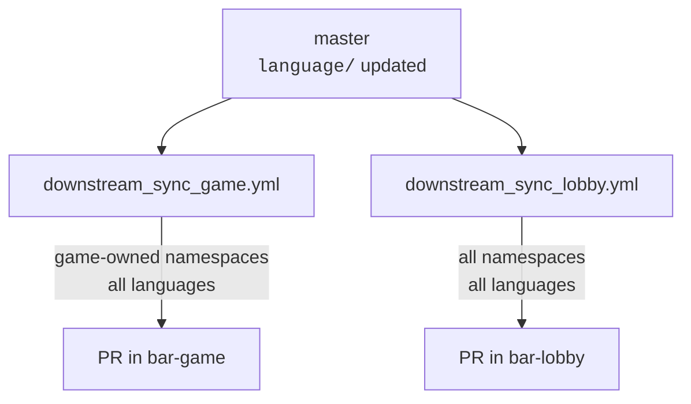

# Downstream Sync

When translations land on `master`, they are pushed back to consumer repos automatically.

```mermaid
flowchart TD
    A["master<br/><code>language/</code> updated"] --> B["downstream_sync_game.yml"]
    A --> C["downstream_sync_lobby.yml"]
    B -->|"game-owned namespaces<br/>all languages"| D["PR in bar-game"]
    C -->|"all namespaces<br/>all languages"| E["PR in bar-lobby"]
```
