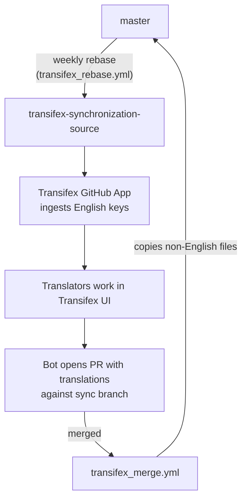

# Transifex Sync

Translations flow between this repo and Transifex via a dedicated sync branch.

```mermaid
flowchart TD
    A["master"] -->|"weekly rebase<br/>(transifex_rebase.yml)"| B["transifex-synchronization-source"]
    B --> C["Transifex GitHub App<br/>ingests English keys"]
    C --> D["Translators work in Transifex UI"]
    D --> E["Bot opens PR with translations<br/>against sync branch"]
    E -->|"merged"| F["transifex_merge.yml"]
    F -->|"copies non-English files"| A
```
