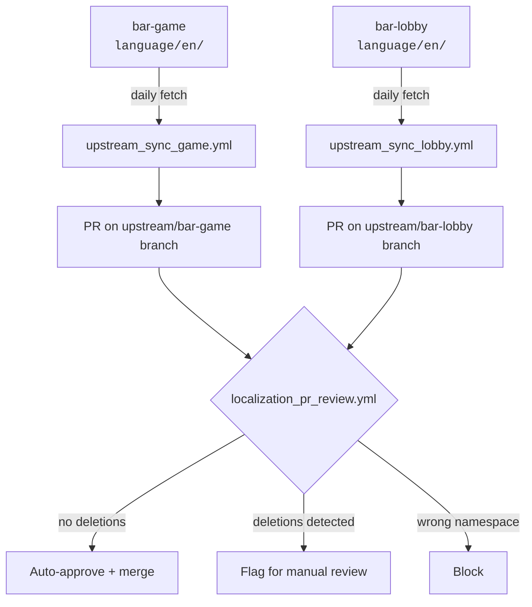

# Upstream Sync

English source strings are pulled from consumer repos daily.

```mermaid
flowchart TD
    A["bar-game<br/><code>language/en/</code>"] -->|daily fetch| B["upstream_sync_game.yml"]
    C["bar-lobby<br/><code>language/en/</code>"] -->|daily fetch| D["upstream_sync_lobby.yml"]
    B --> E["PR on upstream/bar-game branch"]
    D --> F["PR on upstream/bar-lobby branch"]
    E --> G{"localization_pr_review.yml"}
    F --> G
    G -->|no deletions| H["Auto-approve + merge"]
    G -->|deletions detected| I["Flag for manual review"]
    G -->|wrong namespace| J["Block"]
```
